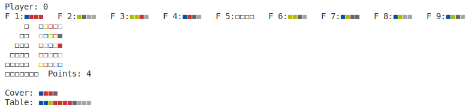
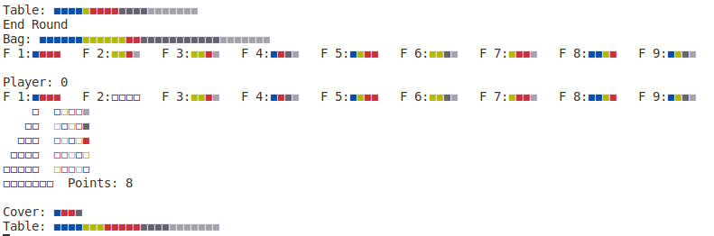
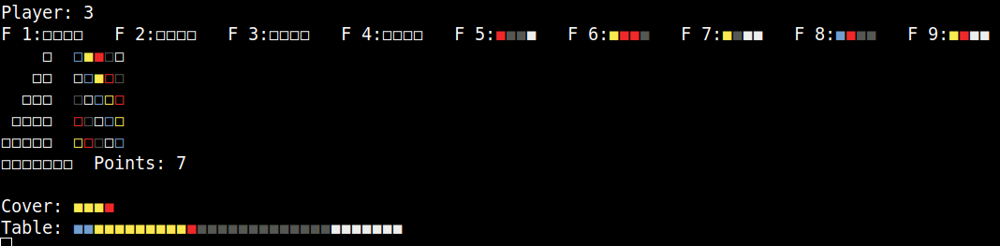

# Azul

## Preparación de la partida

Para iniciar la partida se realizan las siguientes acciones:

1. Se inicializan los jugadores, en este caso 4, con ayuda del predicado **`newPlayers(Players)`** que triunfa *si Players es un conjunto válido de jugadores*.
2. Se inicializa una tapa vacía con ayuda del predicado **`coverEmpty(Cover)`** que triunfa *si Cover es una tapa válida.*
3. Se inicializa una mesa vacía con ayuda del predicado **`table(Table)`** que triunfa *si Table es una mesa válida.*
4. Se inicializa una bolsa con ayuda del predicado **`initializeBag(Bag)`** que triunfa *si Bag es una bolsa válida con 20 azulejos de cada color*.
5. Se inicializan 9 factorías con ayuda del predicado **`makeNFactories(9, Bag, Factories, ResultBag)`**. Se realiza de la siguiente forma:
    - Se toman aleatoriamente 4 elementos de la bolsa en el n-ésimo llamado y se colocan en la n-ésima factoría.
    - Se llama recursivamente a llenar las restantes con la bolsa resultante.
    - El resultado es una lista de factorías que se devuelve en **`Factories`** y una bolsa modificada que se devuelve en **`ResultBag`**.

## Partida

Originalmente en el juego se cuenta con tres fases:

1. Oferta de factoría.
2. Alicatado de pared.
3. Preparación de la siguiente ronda.

En el caso de nuestra simulación del juego, se puede decir que se fusionan las dos primeras fases, puesto que las acciones de un jugador en la primera fase no afectan las acciones de otro jugador en la segunda; pero formalmente pueden verse como eventos separados. Antes de explicar cada una de las fases realizaremos algunas consideraciones generales.

El predicado que ejecuta la partida a un nivel más general es **`play(Players, Factories, Bag, Cover, Table, Mask)`** que triunfa *si se termina un juego válido*:

- Dentro de éste predicado se encuentra el predicado **`round(Players, Factories, Mask, Cover, Table, ResultMask, ResultCover, ResultTable, ResultPlayers, Initial, EOG)`** que triunfa *si termina una ronda válida*.
  - En **`ResultCover`** se encuentra el **`Cover`** resultante de terminar la ronda; de forma análoga en el resto de los elementos de la forma **`[Something]Result`**.
  - En **`Initial`** se guarda qué jugador deberá tomar la ficha de jugador inicial en la siguiente ronda.
  - En **`EOG`** se guarda si la partida terminó en la ronda, en cuyo caso se detiene la evaluación y se muestra el ganador.
  - **`Mask`** es una máscara auxiliar.
  - Éste predicado es recursivo y cada vez que termina una ronda, se llama a sí mismo con los elementos necesarios modificados.

La **estrategia** implementada para los jugadores se basa en un punto de vista **greedy**.

En cada turno, el jugador va a tomar la jugada que más puntos sume en ese instante de tiempo. Para determinar dicha jugada, se simula cada una de las posibilidades y se calculan los puntos que se obtendrían.

### Oferta de factoría

Aquí comienza a cobrar importancia nuestra estrategia. La oferta de factoría se realiza utilizando para cada jugador el predicado **`bestTake(Factories, Table, PatternLines, Wall, [SelectedFactory, SelectedColor, SelectedPatternLine], Mask)`** que triunfa *si **`SelectedFactory`**, **`SelectedColor`**, **`SelectedPatternLine`** constituyen la tupla **Factoría, Color, Línea de Patrón** de selección óptima en ese instante de tiempo, con óptima dígase la que más puntos suma*. Para tomar decisiones dentro de este predicado, se simula cada posibilidad y se hace una comparación de los puntos generados por cada una. Aquí un ejemplo que ilustra una selección óptima:

Veamos el estado del tablero del jugador *Player 0* :



En la próxima ronda se muestra la jugada que más puntos le brindaba en el momento:



Se puede ver que es la jugada que más puntos le daría. Tomar de la factoría 2 (F2), colocar el azulejo blanco en la primera fila de patrones y por tanto pasarlo al muro. Ninguna otra posible jugada brinda más puntos que esta, ya que en esta se aprovecha la continuidad de la columna de azulejos en el muro.

*En el caso de que haya más de una solución óptima se toma la primera que se haya explorado. Se explora en el orden de las factorías, de las líneas de patrón y por último se explora la opción de tomar de la mesa, teniendo en cuenta la penalidad que ésto significa.

### Alicatado de pared

Esta fase se realiza para cada jugador con ayuda del predicado **`fromPLToWall(PatternLines, ResultPatternLines, Wall, ResultWall, Cover, ResultCover, Floor, Points, ResultPoints)`** que triunfa *si **`ResultWall`** es un muro resultado de un alicatado de pared válido teniendo en cuenta las líneas de patrón en **`PatternLines`** con **`PointsResult`** puntos como resultado atendiendo a **`Points`** puntos iniciales. **`ResultPatternLines`** debe ser resultado de modificar **`PatternLines`**, **`Floor`** debe ser el suelo resultante, y **`ResultCover`** debe ser la tapa resultante después de modificar **`Cover`***.

### Preparando la siguiente ronda

Para preparar la siguiente ronda se utiliza el predicado **`nextRound(Factories, Bag, Cover, ResultFactories, ResultBag, ResultCover)`** que triunfa *si **`ResultFactories, ResultBag, ResultCover`** son el resultado de modificar **`Factories, Bag, Cover`** para obtener un estado consistente para continuar con otra ronda*. Para ello se evalúan los siguientes predicados:

- **`refillFactories(Factories, Bag, ResultFactories, ResultBag)`** que triunfa *si **`ResultFactories`** es el resultado de llenar las factorías en **`Factories`** que hayan sido utilizadas por los jugadores en la ronda. **`ResultBag`** es el resultado de la bolsa después de realizar el llenado*.
- **`checkEmptyBag(Bag, Cover, ResultBag, ResultCover)`** que triunfa *si **`Bag`** no está vacío o si **`Bag`** está vacío y el contenido de **`ResultBag`** es el contenido de **`Cover`** y **`ResultCover`** es el resultado de modificar **`Cover`** para ello*.

## Final de la partida

El final de la partida se determina por el argumento de salida **`EOG`** en cada ronda. En el caso de que ésta tenga el valor `true`, se muestra como ganador el jugador cuya jugada ha determinado el fin de la partida. La línea indicadora es:

    El jugador [ID] ha ganado.

## Ejecución del proyecto

Para iniciar la partida es necesario abrir una terminal con *Prolog* en la carpeta del proyecto y seguir los siguientes pasos:

1. Importar el archivo principal:

    ```prolog
    ?- consult('main.pl').
    ```

2. Iniciar la ejecución del juego:

    ```
    ?- game.
    ```

El juego no se ejecuta de una vez completamente, se detiene en cada jugada a la espera que se presione cualquier tecla para continuar a la próxima jugada. Si desea que se ejecute rápidamente deje presionada cualquier tecla hasta que el juego llegue al final.

En cada jugada se muestra la siguiente información en la terminal:



Donde se muestra el identificador del jugador, el estado de las factorías, las líneas de patrones, el muro, el piso, los puntos acumulados, la tapa del juego y el centro de la mesa.

## Tipos y estructuras auxiliares

### COLOR

El conjunto de colores se define como **`{azul, amarillo, rojo, negro, blanco}`**. Además se mantiene el convenio del orden, por lo que a cada color se le puede asociar un índice : **`azul:0, amarillo:1, rojo:2, negro:3, blanco:4`**.

### COUNT

Un elemento **`COUNT`** es un número entero mayor o igual que 0

### VALUE

Un **`VALUE`** es un número entero

### BOOL

Un **`BOOL`** solo puede tener dos valores: **`true`** o **`false`**

### ColorTuple (CT)

Un **`ColorTuple`** una tupla que tiene como primer elemento el nombre del color y como segundo elemento un contador

```
[COLOR,COUNT]
```

### ColorVector (CV)

Un **`ColorVector`** es una estructura que almacena un conjunto de **`ColorTuple`**, donde no se repiten colores, como se muestra a continuación:

```
[[COLOR,COUNT], [COLOR,COUNT], ... [COLOR,COUNT]]
```

*Ejemplo*: **`[[azul,2],[amarillo,1],[rojo,0],[negro,5],[blanco,3]]`**

### FloorSpace (FS)

Un **`FloorSpace`** es una tupla en la cual el primer valor indica si el espacio está ocupado o no y la segunda el costo en puntos de tenerlo ocupado

```
[BOOL,VALUE]
```

### FloorVector (FV)

Un **`FloorVector`** consiste en un conjunto de **`FloorSpace`**

```
[[BOOL,VALUE], [BOOL,VALUE], ..., [BOOL,VALUE]]
```

### The Wall

El muro o **`Wall`** es la estructura que contiene los azulejos que el jugador va poniendo. Es la estructura central del juego. Es una lista unidimesional de 25 elementos tipo **`BOOL`**.

### Board

Un **`Board`** es el tablero con que juega el jugador. Está compuesto por un **`Wall`**, un **`FloorVector`** y un **`PatternLines`**. Por lo que se representa como una tupla de la siguiente forma:

```
[Wall, FloorVector, PatternLines]
```

### Player

Un jugador o **`Player`** es una tupla de tres elementos **`Id, Board, Points`**. Donde **`Id`** es un identificador cualquiera y único entre todos los jugadores, **`Board`** es el tablero con el que juega el jugador y **`Points`** la puntuación del jugador.

Los puntos del jugador son de tipo **`COUNT`** ya que nunca se puede tener menos de 0 puntos.

### Factory

Una factoría o **`Factory`** no es más que un conjunto de azulejos, por lo que su representación es igual que la de un **`ColorVector`**

### Table

Una mesa o **`Table`** no es más que un conjunto de azulejos, por lo que su representación es igual que la de un **`ColorVector`**

### Bag

Una bolsa o **`Bag`** es un conjunto de azulejos, del cuál se desea extraer de forma aleatoria. Entonces es equivalente a extraer un azulejo de un color aleatorio, el problema es cuando no hay azulejos de ese color en la bolsa. Por este problema la bolsa es una tupla **`ColorVector`**, **`Mask`**. Donde **`Mask`** es el conjunto de índices de **`ColorVector`** que tienen al menos un azulejo.

```
[ColorVector, Mask]
```

### Cover

Una tapa o **`Cover`** no es más que un conjunto de azulejos, por lo que su representación es igual que la de un **`ColoVector`**

### Game

Una partida o **`Game`** es el tipo o estructura que agrupa al juego en su totalidad. Está compuesto por una lista de **`Player`**, un conjunto de **`Factory`**, un **`Table`**, un **`Bag`** y un **`Cover`**.

La cantidad de jugadores solo puede ser 2,3 o 4; y la cantidad de **`Factory`** depende de ello.

| Cantidad de jugadores | Cantidad de factorías |
| ---                   | ---                   |
| 2                     | 5                     |
| 3                     | 7                     |
| 5                     | 9                     |